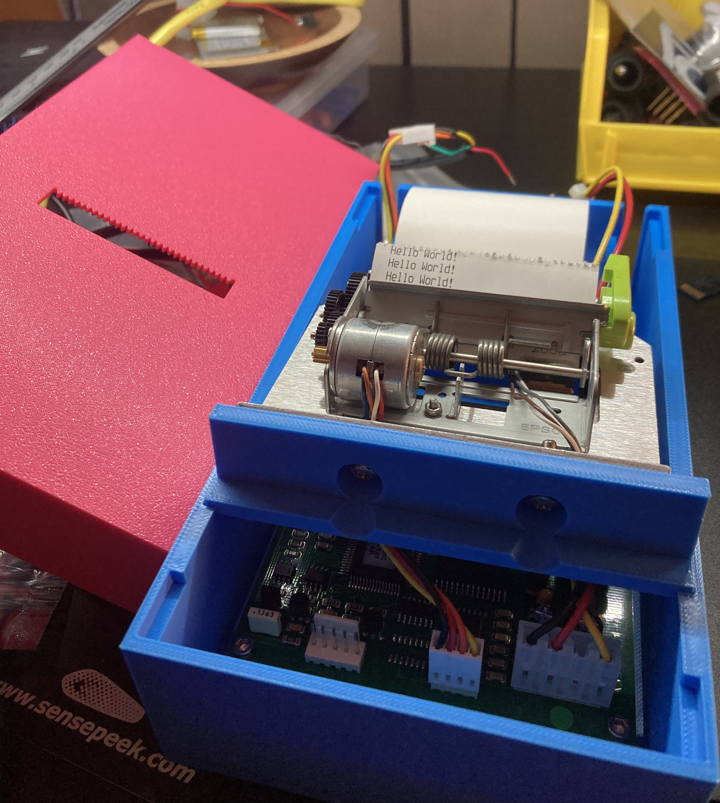

# P1120 - Able Systems Label Printer

This project is both an enclosure for a ATB102 label printer I got a hold of, and a C interface library and application to print to it.

*This project is NOT affiliated with ABLE systems*

# Wiring

For my setup I had +7v connected to Vmech (left-side most pin of the power connector) and GND (second or last pin). I did not need to provide power to the 3rd pin.

The data connector is the one nearest connector to the power one.
I had it connected, in order from the pin closes to the power connector, to a USB-RS232-WE cable as follows:

| ABLE  | USB-RS232 |
|-------|-----------|
| RX    | TX        |
| TX    | RX        |
| Busy  | CTS       |
| GND   | GND       |

# Library
Inside [src](`src`) is an abstract library to interface to the ABLE printer, agnostic of any underlying system. I designed it that way so it's easily usable in embedded system, such as with a microcontroller. I also wrote a Linux test app for testing the library

To make the application, run the makefile in the folder.

# License
This project is licensed as:
- [CAD/LICENSE.md](GPLv3) For the CAD files
- [src/LICENSE](MIT) for the C library and test application
